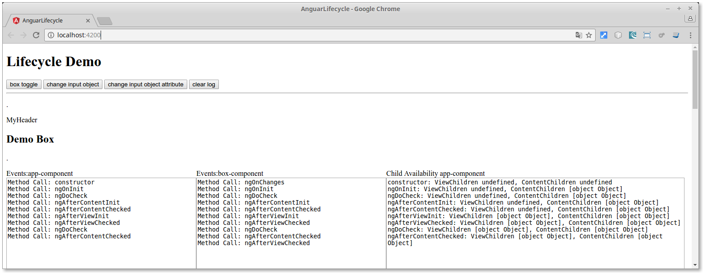

# Lifycycle Methoden von Angular
Blog [https://javaeeblog.wordpress.com/?p=3338](https://javaeeblog.wordpress.com/?p=3338)

 - ngOnInit
 - ngOnChanges
 - ngAfterContentInit
 - ngAfterViewInit
 - ngOnDestroy
 - ngAfterViewChecked
 - ngAfterContentChecked
 - ngDoCheck



```
by GEDOPLAN, Dominik Mathmann
```
